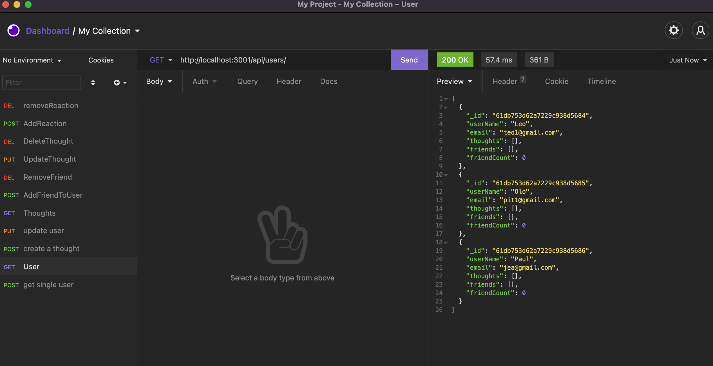

# Social-Network-Api

## Description
 Social-Network-Api is an application that allows the user to create users and manage their users's friends thoughts and reactions. This application displays creation of database using NOSQL with models and associations.

## Core Skills

* Node.js
* Nosql
* Mongoose
* Express
* Moment
* CRUD

## Mock-Up

## Review

* Video demo that showcase the utilization of the app. This video will be in two section. Thanks for   watching
  * [demo1](https://watch.screencastify.com/v/lNIk9fp5rQJNI4m7CPNQ)
  * [demo2](https://watch.screencastify.com/v/ZOqUvNwZnwHIS7IcZ675)

* The URL of the GitHub repository 
* [Repository](https://github.com/Chrisolsen1993/Social-Network-Api)
